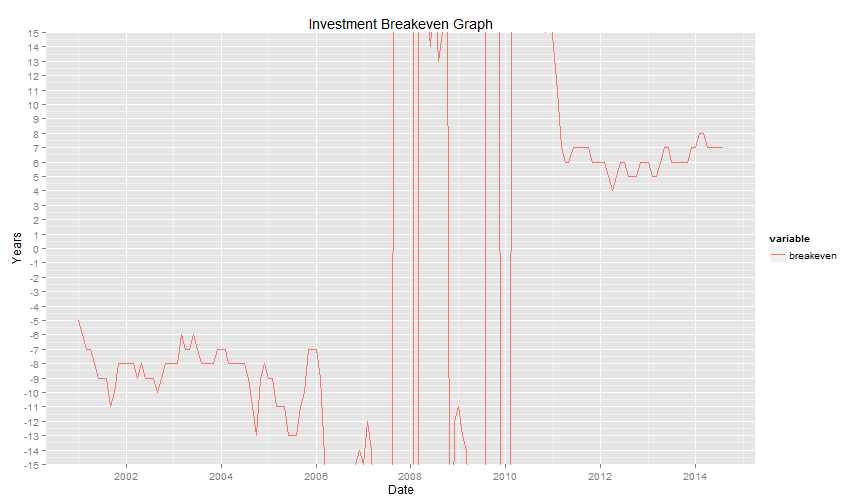

## Introduction ##

NGVBreakeven is a clould-based investment breakeven calculator for Compressed Natural Gas (CNG) powered vehicles. It provides a historical time series of how long it takes for an initial investment to payback based on the savings of using CNG fuel compared to Diesel based on historical data. 

-> Calculator Inputs
  - Vehicle Related Assumptions
  - CNG Pricing Related Assumptions
  
-> Calculator Outputs 
  - Historical Graph of Fuel Prices
  - Historical Graph of Investment Breakeven
  - Data table

---

## Using the Calculator ##

NGVBreakeven can be accessed via the web at https://cleanfinllc.shinyapps.io/ngvbreakeven/

-> Enter Vehicle Related Assumptions
  - Vehicle Price 
  - Annual Mileage
  - MPG of Diesel Vehicle
  - MPG of CNG Vehicle (in Diesel Gallon Equivalent)
  
-> Enter CNG Pricing Related Assumptions
  - Acquisition Marketing Costs
  - Electric Compression Costs
  - Mainteance Costs
  - Capital Amortization Costs
  

---

## Why NGVBreakeven? ##

There are key reasons to using NGVBreakeven as a screening tool to look at the economics of owning a CNG powered vehicle

- Uses publicly available data on fuel prices from U.S. Energy Information Administration (EIA)
- The calculator is dynamic and will update itself to get the latest pricing data
- The breakeven is calculated not only for current fuel prices but also historically back to 2001. The user can make a rational decision on the relative value of the investment by comparing the current breakeven with historical values
- Ease of use. Just point to the URL, enter your data and you are in business

---

## Results ##

